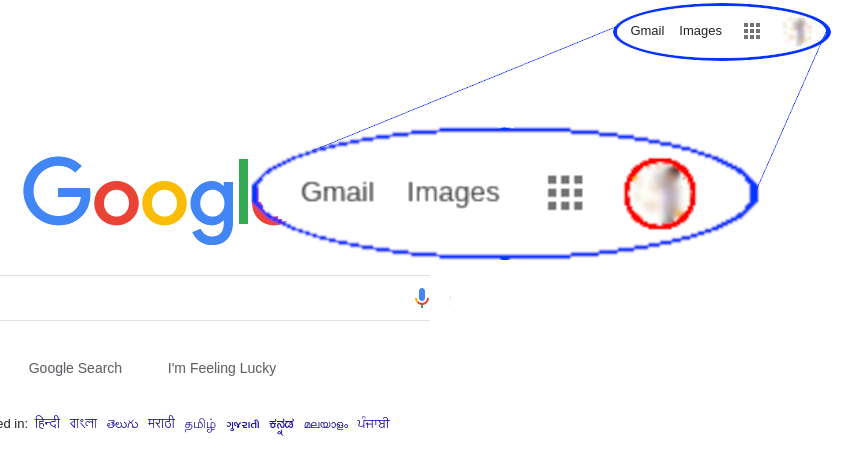
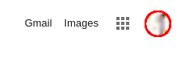
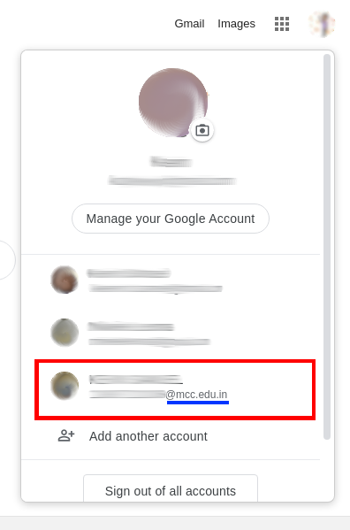
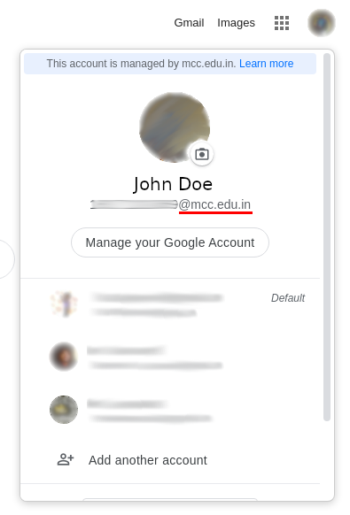
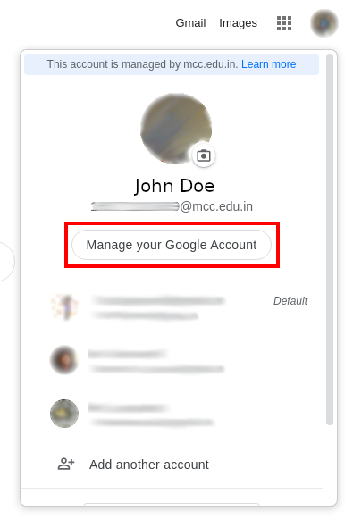
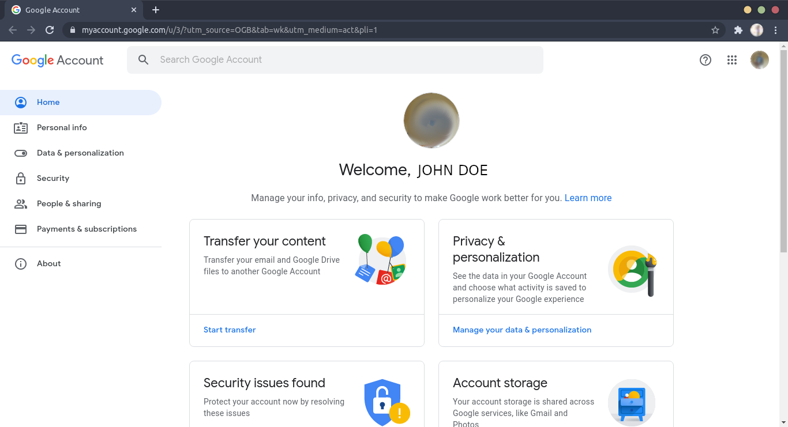
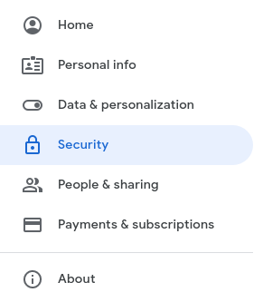
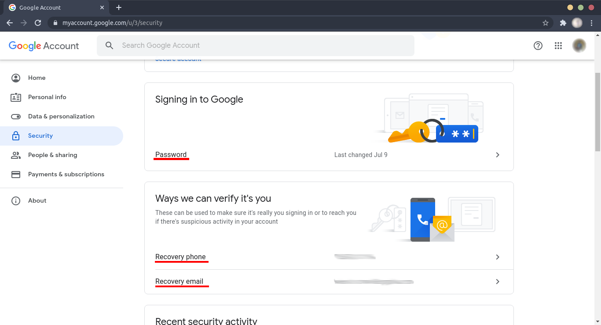

1. Go to [google.com](https://google.com)
   
2. Click on the circle showing your user profile
   
3. Switch to your @mcc.edu.in account
   
4. Once switched, open the account switcher again
   
5. Ensure that you are logged into your @mcc.edu.in account
6. Click on Manage your Google Account
   
7. You will be at your Account Page
   
8. On the left, click on the Security tab
   
9. Scroll down to these sections
   
10. Reset your Password and add Recovery contacts

## Hope you have a good e-learning experience
